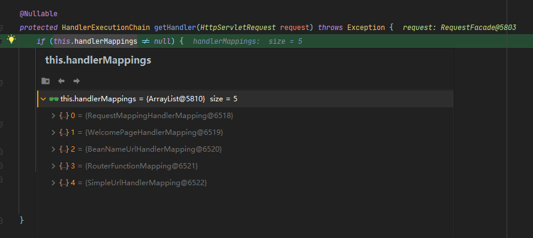
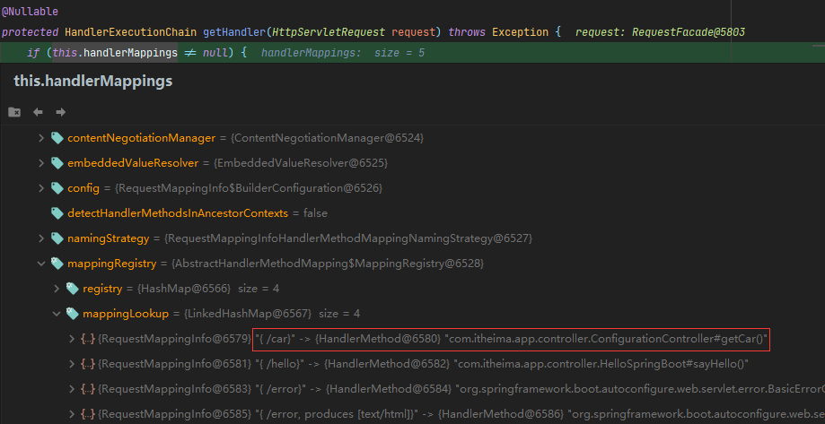

1、rest使用与原理  基于表单提交的rest
@xxxMapping；
Rest风格支持（使用HTTP请求方式动词来表示对资源的操作）
以前：/getUser   获取用户     /deleteUser 删除用户    /editUser  修改用户       /saveUser 保存用户
现在： /user    GET-获取用户   DELETE-删除用户   PUT-修改用户   POST-保存用户
核心Filter；HiddenHttpMethodFilter

用法： 表单method=post，隐藏域 _method=put
SpringBoot中手动开启
扩展：如何把_method 这个名字换成我们自己喜欢的。

springboot底层是如何自动帮助我们配置的

    @Bean
    //如果说用户没有配置HiddenHttpMethodFilter 则spring会帮助我们配置一个
	@ConditionalOnMissingBean(HiddenHttpMethodFilter.class)
    //matchIfMissing 如果没有配置则 认为该类不生效 所以功能需要手动开启
	@ConditionalOnProperty(prefix = "spring.mvc.hiddenmethod.filter", name = "enabled", matchIfMissing = false)
	public OrderedHiddenHttpMethodFilter hiddenHttpMethodFilter() {
		return new OrderedHiddenHttpMethodFilter();
	}

总结：restful使用需要手动配置开启
spring.mvc.hiddenmethod.filter.enabled=true

具体是如何处理的：
      
    org.springframework.web.filter.HiddenHttpMethodFilter
     //真正处理PUT DELETE请求的映射方法
     protected void doFilterInternal(HttpServletRequest request, HttpServletResponse response, FilterChain filterChain) throws ServletException, IOException {
        HttpServletRequest requestToUse = request;
        //判断请求是POST才可以使用restful风格 
        if ("POST".equals(request.getMethod()) && request.getAttribute("javax.servlet.error.exception") == null) {
            //得到请求的表单的参数信息 获取到_method的值DELETE 或者PUT
            String paramValue = request.getParameter(this.methodParam);
            if (StringUtils.hasLength(paramValue)) {
                //表单中大写小写put或者delete都可以 这里会自动转
                String method = paramValue.toUpperCase(Locale.ENGLISH);
                if (ALLOWED_METHODS.contains(method)) {
                    //原生request（post），包装模式requesWrapper重写了getMethod方法，返回的是传入的值  
                    //HttpMethodRequestWrapper重写了HttpServletRequest的getMethod()方法 将原来的POST请求替换为_method的值
                    requestToUse = new HiddenHttpMethodFilter.HttpMethodRequestWrapper(request, method);
                }
            }
        }
        //过滤器链放行的时候用wrapper。以后的方法调用getMethod是调用requesWrapper的
        filterChain.doFilter((ServletRequest)requestToUse, response);
    }
    ALLOWED_METHODS详解：支持PUT，DELETE，PATCH类型的请求
    static {
        ALLOWED_METHODS = Collections.unmodifiableList(Arrays.asList(HttpMethod.PUT.name(), HttpMethod.DELETE.name(), HttpMethod.PATCH.name()));
    }
总结：POST请求被拦截修改为DELETE/PUT

客户端(比如Postman)直接发PUT和DELETE就不会过该Filter
所以说 spring.mvc.hiddenmethod.filter.enabled=true是选择性开启 只适用于表单提交

restful风格的注解 @PutMapping @DeleteMapping @GetMapping @PostMapping

>请求映射原理 可以参照SpringMVC的文档研究这个继承关系
SpringMVC功能分析都从 org.springframework.web.servlet.DispatcherServlet-》doDispatch（）

    protected void doDispatch(HttpServletRequest request, HttpServletResponse response) throws Exception {
        HttpServletRequest processedRequest = request;
        HandlerExecutionChain mappedHandler = null;
        boolean multipartRequestParsed = false;
        //异步管理器
        WebAsyncManager asyncManager = WebAsyncUtils.getAsyncManager(request);
    
            try {
                try {
                    ModelAndView mv = null;
                    Object dispatchException = null;
    
                    try {
                        1.检查是否是一个文件上传的请求
                        processedRequest = this.checkMultipart(request);
                        //如果是一个文件上传的请求那么在这里进行封装
                        multipartRequestParsed = processedRequest != request;
                        //mappedHandler 决定那个请求可以由那个Handler(Controller)来处理
                        mappedHandler = this.getHandler(processedRequest);
                        if (mappedHandler == null) {
                            this.noHandlerFound(processedRequest, response);
                            return;
                        }
    
                        HandlerAdapter ha = this.getHandlerAdapter(mappedHandler.getHandler());
                        String method = request.getMethod();
                        boolean isGet = "GET".equals(method);
                        if (isGet || "HEAD".equals(method)) {
                            long lastModified = ha.getLastModified(request, mappedHandler.getHandler());
                            if ((new ServletWebRequest(request, response)).checkNotModified(lastModified) && isGet) {
                                return;
                            }
                        }
    
                        if (!mappedHandler.applyPreHandle(processedRequest, response)) {
                            return;
                        }
    
                        mv = ha.handle(processedRequest, response, mappedHandler.getHandler());
                        if (asyncManager.isConcurrentHandlingStarted()) {
                            return;
                        }
    
                        this.applyDefaultViewName(processedRequest, mv);
                        mappedHandler.applyPostHandle(processedRequest, response, mv);
                    } catch (Exception var20) {
                        dispatchException = var20;
                    } catch (Throwable var21) {
                        dispatchException = new NestedServletException("Handler dispatch failed", var21);
                    }
    
                    this.processDispatchResult(processedRequest, response, mappedHandler, mv, (Exception)dispatchException);
                } catch (Exception var22) {
                    this.triggerAfterCompletion(processedRequest, response, mappedHandler, var22);
                } catch (Throwable var23) {
                    this.triggerAfterCompletion(processedRequest, response, mappedHandler, new NestedServletException("Handler processing failed", var23));
                }
    
            } finally {
                if (asyncManager.isConcurrentHandlingStarted()) {
                    if (mappedHandler != null) {
                        mappedHandler.applyAfterConcurrentHandlingStarted(processedRequest, response);
                    }
                } else if (multipartRequestParsed) {
                    this.cleanupMultipart(processedRequest);
                }
    
            }
    }
    请求映射原理：
    mappedHandler = this.getHandler(processedRequest);

    @Nullable
    protected HandlerExecutionChain getHandler(HttpServletRequest request) throws Exception {
    if (this.handlerMappings != null) {
    Iterator var2 = this.handlerMappings.iterator();

            while(var2.hasNext()) {
                HandlerMapping mapping = (HandlerMapping)var2.next();
                HandlerExecutionChain handler = mapping.getHandler(request);
                if (handler != null) {
                    return handler;
                }
            }
        }

    //找可以处理该请求的handler
    @Nullable
    protected HandlerExecutionChain getHandler(HttpServletRequest request) throws Exception {
        if (this.handlerMappings != null) {
            Iterator var2 = this.handlerMappings.iterator();

            while(var2.hasNext()) {
                HandlerMapping mapping = (HandlerMapping)var2.next();
                HandlerExecutionChain handler = mapping.getHandler(request);
                if (handler != null) {
                    return handler;
                }
            }
        }

        return null;
    }

handlerMappings：保存的就是那个请求通过那个controller处理的对应关系

默认包含5个handlerMapping：
WelcomeMappingHandlerMapping 保存了首页要访问呢的规则 当访问 / 自动跳转到index.html
RequestMappingHandlerMapping 处理@RequestMapping注解映射规则(应用启动时解析注解保存)

所有的请求映射都在HandlerMapping中。

● SpringBoot自动配置欢迎页的 WelcomePageHandlerMapping 。访问 /能访问到index.html；
● SpringBoot自动配置了默认 的 RequestMappingHandlerMapping
● 请求进来，挨个尝试所有的HandlerMapping看是否有请求信息。
    ○ 如果有就找到这个请求对应的handler
    ○ 如果没有就是下一个 HandlerMapping
● 我们需要一些自定义的映射处理，我们也可以自己给容器中放HandlerMapping。自定义 HandlerMapping

普通参数与基本注解
1.1、注解：
@PathVariable、@RequestHeader、@ModelAttribute、@RequestParam、@MatrixVariable、@CookieValue、@RequestBody

1.2、Servlet API：
WebRequest、ServletRequest、MultipartRequest、 HttpSession、javax.servlet.http.PushBuilder、Principal、InputStream、Reader、HttpMethod、Locale、TimeZone、ZoneId

1.3、复杂参数：
Map、Model（map、model里面的数据会被放在request的请求域  request.setAttribute）、Errors/BindingResult、RedirectAttributes（ 重定向携带数据）、ServletResponse（response）、SessionStatus、UriComponentsBuilder、ServletUriComponentsBuilder

1.4、自定义对象参数：
可以自动类型转换与格式化，可以级联封装。